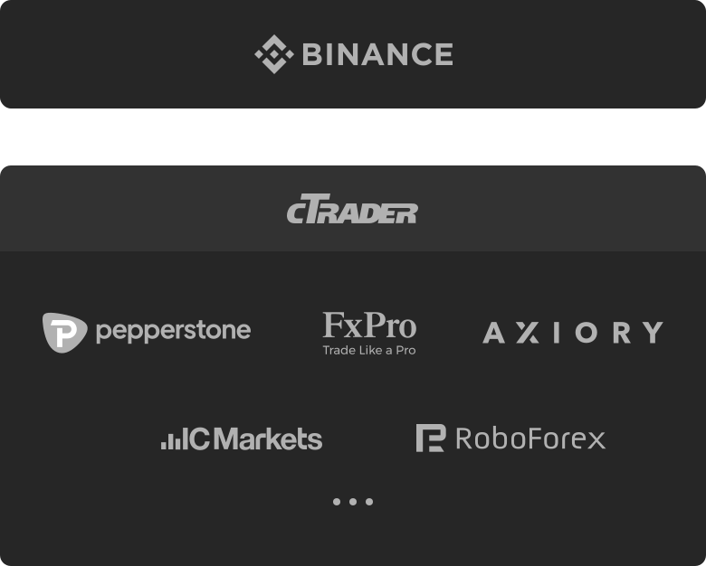

<br><br>
<p align="center">
    
    
</p>
<br>
<p align="center">
    <b>The open-source and cross-platform trading framework</b>
    <br><br>
    <a href="https://www.mida.org">Home</a> &mdash;
    <a href="https://www.mida.org/documentation">Documentation</a> &mdash;
    <a href="https://www.mida.org/api">API</a> &mdash;
    <a href="https://www.mida.org/ecosystem">Ecosystem</a>
</p>
<br>
<p align="center">
    <a href="https://www.npmjs.com/package/@reiryoku/mida">
        
    </a>
    <a href="./LICENSE">
        
    </a>
    <a href="https://discord.gg/cKyWTUsr3q">
        
    </a>
</p>
<br><br>

## Introduction
Mida is an open-source and cross-platform trading framework developed by Reiryoku Technologies and its contributors.
The framework is designed from the ground up to provide a solid, versatile and platform-neutral
environment for creating algorithmic trading systems, indicators, market analysis tools or just trading
applications depending on use cases.

### Programming languages
Mida can be used with TypeScript, JavaScript and C++ on [Node.js](https://nodejs.org) and
is distributed on [npm](https://www.npmjs.com).
The Mida ecosystem is built from the ground up in TypeScript and C++.

### Community
Join the community on [Discord](https://discord.gg/cKyWTUsr3q) and [Telegram](https://t.me/joinmida)
to get help you with your first steps.

## Table of contents
* [Ecosystem](#ecosystem)
* [Trading platforms](#trading-platforms)
* [Installation](#installation)
* [Usage](#usage)
    * [Account login](#account-login)
    * [Balance, equity and margin](#balance-equity-and-margin)
    * [Orders, trades and positions](#orders-trades-and-positions)
    * [Decimals](#decimals)
    * [Symbols and assets](#symbols-and-assets)
    * [Ticks and candlesticks](#ticks-and-candlesticks)
    * [Paper trading](#paper-trading)
    * [Trading systems](#trading-systems)
    * [Technical indicators](#technical-indicators)
* [License and disclaimer](#license-and-disclaimer)
* [Contributors](#contributors)

## Ecosystem
| Project                                                               | Status                                                                                                                | Description                                              |
|-----------------------------------------------------------------------|-----------------------------------------------------------------------------------------------------------------------|----------------------------------------------------------|
| [Mida](https://github.com/Reiryoku-Technologies/Mida)                 | [](https://www.npmjs.com/package/@reiryoku/mida)                 | The Mida core                                            |
| [Mida Binance](https://github.com/Reiryoku-Technologies/Mida-Binance) | [](https://www.npmjs.com/package/@reiryoku/mida-binance) | A Mida plugin for using Binance                          |
| [Mida cTrader](https://github.com/Reiryoku-Technologies/Mida-cTrader) | [](https://www.npmjs.com/package/@reiryoku/mida-ctrader) | A Mida plugin for using cTrader                          |
| [Mida Tulipan](https://github.com/Reiryoku-Technologies/Mida-Tulipan) | [](https://www.npmjs.com/package/@reiryoku/mida-tulipan) | A Mida plugin providing technical analysis indicators    |
| [Apollo](https://github.com/Reiryoku-Technologies/Apollo)             | [](https://www.npmjs.com/package/@reiryoku/apollo)             | A JavaScript library for getting real-time economic data |

## Trading platforms
Mida is platform-neutral, this means that any trading platform could
be easily integrated in the ecosystem. Trading applications built with Mida can be
easily executed on different trading platforms without changes in the implementation. Here are some of the most
popular supported trading platforms.

<br><br>
<p align="center">
    
</p>
<br><br>

## Installation
To get started with Mida you need [Node.js](https://nodejs.org) (at least version 16) and
[npm](https://www.npmjs.com) installed.<br>
At this point use the command below in your terminal. The installer will pop up and guide you through
the creation of a new Mida project.
```bash
npm init mida
```

## Usage
### Account login
How to login into a Binance Spot account.
```javascript
import { login, } from "@reiryoku/mida";

const myAccount = await login("Binance/Spot", {
    apiKey: "***",
    apiSecret: "***",
});
```
Read [how to use Mida with Binance](https://www.mida.org/posts/how-to-use-mida-with-binance/) to get the `apiKey` and `apiSecret` credentials.

How to login into a cTrader account.
```javascript
import { login, } from "@reiryoku/mida";

const myAccount = await login("cTrader", {
    clientId: "***",
    clientSecret: "***",
    accessToken: "***",
    cTraderBrokerAccountId: "***",
});
```
Read [how to use Mida with cTrader](https://www.mida.org/posts/how-to-use-mida-with-ctrader/) to get the `clientId`, `clientSecret`, `accessToken` and `cTraderBrokerAccountId` credentials.

How to login into multiple accounts.
```javascript
import { login, } from "@reiryoku/mida";

const myAccount1 = await login("cTrader", { /* ... */ });
const myAccount2 = await login("Binance/Spot", { /* ... */ });
const myAccount3 = await login("FTX/Futures", { /* ... */ });
```

### Balance, equity and margin
How to get the account balance, equity and margin.
```javascript
import { info, } from "@reiryoku/mida";

info(await myAccount.getBalance());
info(await myAccount.getEquity());
info(await myAccount.getFreeMargin());
info(await myAccount.getUsedMargin());
```

### Orders, trades and positions
How top open a long position for Bitcoin against USDT.
```javascript
import { info, MidaOrderDirection, } from "@reiryoku/mida";

const myOrder = await myAccount.placeOrder({
    symbol: "BTCUSDT",
    direction: MidaOrderDirection.BUY,
    volume: 1,
});

info(myOrder.id);
info(myOrder.executionPrice);
info(myOrder.positionId);
info(myOrder.trades);

const myPosition = await order.getPosition();

info(myPosition);
```

How to open a short position for EUR against USD.
```javascript
import { info, MidaOrderDirection, } from "@reiryoku/mida";

const myOrder = await myAccount.placeOrder({
    symbol: "EURUSD",
    direction: MidaOrderDirection.SELL,
    volume: 0.1,
});

info(myOrder.id);
info(myOrder.executionPrice);
info(myOrder.positionId);
info(myOrder.trades);

const myPosition = await order.getPosition();

info(myPosition);
```

How to open a long position for Apple stocks with error handler.
```javascript
import {
    info,
    MidaOrderDirection,
    MidaOrderRejection,
} from "@reiryoku/mida";

const myOrder = await myAccount.placeOrder({
    symbol: "#AAPL",
    direction: MidaOrderDirection.BUY,
    volume: 888,
});

if (myOrder.isRejected) {
    switch (myOrder.rejection) {
        case MidaOrderRejection.MARKET_CLOSED: {
            info("#AAPL market is closed!");

            break;
        }
        case MidaOrderRejection.NOT_ENOUGH_MONEY: {
            info("You don't have enough money in your account!");

            break;
        }
        case MidaOrderRejection.INVALID_SYMBOL: {
            info("Your account doesn't support trading Apple stocks!");

            break;
        }
    }
}
```

<details>
<summary>More examples</summary>

How to open a long position for GBP against USD with stop loss and take profit.
```javascript
import { MidaOrderDirection, } from "@reiryoku/mida";

const symbol = "GBPUSD";
const lastBid = await myAccount.getSymbolBid(symbol);
const myOrder = await myAccount.placeOrder({
    symbol,
    direction: MidaOrderDirection.BUY,
    volume: 0.1,
    protection: {
        stopLoss: lastBid.subtract(0.0010), // <= SL 10 pips
        takeProfit: lastBid.add(0.0030), // <= TP 30 pips
    },
});
```

How to close an open position.
```javascript
import {
    MidaOrderDirection,
    MidaPositionDirection,
} from "@reiryoku/mida";

await myPosition.close();
// or
await myPosition.subtractVolume(myPosition.volume);
// or
await myAccount.placeOrder({
    positionId: myPosition.id,
    direction: myPosition.direction === MidaPositionDirection.LONG ? MidaOrderDirection.SELL : MidaOrderDirection.BUY,
    volume: myPosition.volume,
});
```

How to retrieve all pending orders and open positions.
```javascript
import { info, } from "@reiryoku/mida";

info(await myAccount.getPendingOrders());
info(await myAccount.getOpenPositions());
```

How to set take profit and stop loss for an open position.
```javascript
await myPosition.changeProtection({
    takeProfit: 200,
    stopLoss: 100,
});
```

</details>

### Decimals
Decimal numbers and calculations are accurately represented by the `MidaDecimal` class,
computers can only natively store integers, so they need some way of representing
decimal numbers. This representation is not perfectly accurate. This is why, in
most programming languages `0.1 + 0.2 != 0.3`, for financial and monetary calculations
this can lead to unreversible losses.

```javascript
import { decimal, } from "@reiryoku/mida";

0.1 + 0.2; // 0.30000000000000004
decimal(0.1).add(0.2); // 0.3
decimal("0.1").add("0.2"); // 0.3
```

In Mida, every calculation under the hood is made using decimals and every native number
passed to Mida is internally converted to decimal, input values in the Mida APIs
such as a limit price are usually expressed as a `MidaDecimalConvertible` which is an alias
for `MidaDecimal | string | number`, the input values are internally converted to `MidaDecimal`
and most Mida interfaces exposes decimal numbers unless otherwise stated.

Read more about the [Decimals API](https://www.mida.org/documentation/essentials/decimals.html).

### Symbols and assets
How to retrieve all symbols available for your trading account.
```javascript
import { info, } from "@reiryoku/mida";

const symbols = await myAccount.getSymbols();

info(symbols);
```

How to retrieve a symbol.
```javascript
import { info, } from "@reiryoku/mida";

const symbol = await myAccount.getSymbol("#AAPL");

if (!symbol) {
    info("Apple stocks are not available for this account!");
}
else {
    info(symbol.digits);
    info(symbol.leverage);
    info(symbol.baseAsset);
    info(symbol.quoteAsset);
    info(await symbol.isMarketOpen());
}
```

How to get the price of a symbol.
```javascript
import { info, } from "@reiryoku/mida";

const symbol = await myAccount.getSymbol("BTCUSDT");
const price = await symbol.getBid();

info(`Bitcoin price is ${price} USDT`);

// or

info(await myAccount.getSymbolBid("BTCUSDT"));
```

### Ticks and candlesticks
How to listen the ticks of a symbol.
```javascript
import { info, MidaMarketWatcher, } from "@reiryoku/mida";

const marketWatcher = new MidaMarketWatcher({ tradingAccount: myAccount, });

await marketWatcher.watch("BTCUSDT", { watchTicks: true, });

marketWatcher.on("tick", (event) => {
    const { tick, } = event.descriptor;

    info(`Bitcoin price is now ${tick.bid} USDT`);
});
```

How to get the candlesticks of a symbol (candlesticks and bars are generically called periods).
```javascript
import { info, MidaTimeframe, } from "@reiryoku/mida";

const periods = await myAccount.getSymbolPeriods("EURUSD", MidaTimeframe.M30);
const lastPeriod = periods[periods.length - 1];

info("Last candlestick start time: " + lastPeriod.startTime);
info("Last candlestick OHLC: " + lastPeriod.ohlc);
info("Last candlestick close price: " + lastPeriod.close);
```

How to listen when candlesticks are closed.
```javascript
import {
    info,
    MidaMarketWatcher,
    MidaTimeframe,
} from "@reiryoku/mida";

const marketWatcher = new MidaMarketWatcher({ tradingAccount: myAccount, });

await marketWatcher.watch("BTCUSDT", {
    watchPeriods: true,
    timeframes: [
        MidaTimeframe.M5,
        MidaTimeframe.H1,
    ],
});

marketWatcher.on("period-close", (event) => {
    const { period, } = event.descriptor;

    switch (period.timeframe) {
        case MidaTimeframe.M5: {
            info(`M5 candlestick closed at ${period.close}`);

            break;
        }
        case MidaTimeframe.H1: {
            info(`H1 candlestick closed at ${period.close}`);

            break;
        }
    }
});
```

The `on()` method returns an id that can be used to unsubscribe from the event listener.
```javascript
const id = marketWatcher.on("period-close", (event) => { /* ... */ });

marketWatcher.removeEventListener(id);
```

### Paper trading
Mida comes with an out of the box simulator of exchanges and spot trading accounts,
for paper trading and backtesting read [Paper Trading with Mida](https://www.mida.org/posts/paper-trading-with-mida/).

### Trading systems
How to create a trading system (expert advisor or trading bot).
```javascript
import {
    info,
    MidaTradingSystem,
    MidaTimeframe,
} from "@reiryoku/mida";

class SuperTradingSystem extends MidaTradingSystem {
    watched () {
        return {
            "BTCUSDT": {
                watchTicks: true,
                watchPeriods: true,
                timeframes: [ MidaTimeframe.H1, ],
            },
        };
    }

    async configure () {
        // Called once per instance before the first startup
        // can be used as async constructor
    }

    async onStart () {
        info("The trading system has started...");
    }

    async onTick (tick) {
        // Implement your strategy
    }

    async onPeriodClose (period) {
        info(`H1 candlestick closed at ${period.open}`);
    }

    async onStop () {
        info("The trading system has been interrupted...");
    }
}
```

How to execute a trading system.
```javascript
import { login, } from "@reiryoku/mida";
import { SuperTradingSystem, } from "./SuperTradingSystem";

const myAccount = await login(/* ... */);
const mySystem = new SuperTradingSystem({ tradingAccount: myAccount, });

await mySystem.start();
```

### Technical indicators
Install the plugin providing technical analysis indicators.
```javascript
import { Mida, } from "@reiryoku/mida";
import { TulipanPlugin, } from "@reiryoku/mida-tulipan";

// Use the Mida Tulipan plugin
Mida.use(new TulipanPlugin());
```

How to calculate SMA (Simple Moving Average).
```javascript
import { info, Mida, MidaTimeframe, } from "@reiryoku/mida";

// Get latest candlesticks on H1 timeframe
const candlesticks = await myAccount.getSymbolPeriods("EURUSD", MidaTimeframe.H1);
const closePrices = candlesticks.map((candlestick) => candlestick.close);

// Calculate RSI on close prices, pass values from oldest to newest
const sma = await Mida.createIndicator("SMA").calculate(closePrices);

// Values are from oldest to newest
info(sma);
```

How to calculate RSI (Relative Strength Index).
```javascript
import { info, Mida, MidaTimeframe, } from "@reiryoku/mida";

// Get latest candlesticks on H1 timeframe
const candlesticks = await myAccount.getSymbolPeriods("BTCUSDT", MidaTimeframe.H1);
const closePrices = candlesticks.map((candlestick) => candlestick.close);

// Calculate RSI on close prices, pass values from oldest to newest
const rsi = await Mida.createIndicator("RSI", { period: 14, }).calculate(closePrices);

// Values are from oldest to newest
info(rsi);
```

## License and disclaimer
[LICENSE](./LICENSE)<br><br>
Trading in financial markets is highly speculative and carries a high level of risk.
It's possible to lose all your capital. This project may not be suitable for everyone,
you should ensure that you understand the risks involved. Reiryoku Technologies,
Mida and its contributors are not responsible for any technical inconvenience that
may lead to money loss, for example a stop loss not being set.

## Contributors
| Name         | Contribution           | GitHub                                          | Contact                   |
|--------------|------------------------|-------------------------------------------------|---------------------------|
| Vasile Pește | Founder and maintainer | [Vasile-Peste](https://github.com/Vasile-Peste) | vasile.peste@reiryoku.com |
